# IR_LAB 1 Tutorial

[TOC]


## Lab Introduction

### Development Platforms and Tools Involved

#### Ubuntu

Ubuntu is the most popular Linux distribution in the world. It is an open source software operating system that runs from the desktop, to the cloud, to all your internet connected things.

#### The Robot Operating System (ROS)

The Robot Operating System (ROS) is a flexible framework for writing robot software. 
See: http://www.ros.org

#### TurtleBot

TurtleBot is a low-cost, personal robot kit with open-source software. With TurtleBot, you’ll be able to build a robot that can drive around your house, see in 3D, and have enough horsepower to create exciting applications. 

See:http://wiki.ros.org/Robots/TurtleBot

#### MATLAB Robotics System Toolbox

Robotics System Toolbox™ provides tools and algorithms for designing, simulating, and testing manipulators, mobile robots, and humanoid robots. 

See: https://ww2.mathworks.cn/help/robotics/index.html?searchHighlight=robotics&s_tid=doc_srchtitle

#### Gazebo

Gazebo is a 3D dynamic simulator with the ability to accurately and efficiently simulate populations of robots in complex indoor and outdoor environments.

See: http://gazebosim.org

## Install Ubuntu 20.04 

### Preparation
#### Download Image File of Ubuntu 20.04.4 Desktop

##### 1.1 Plan A

Go to link: https://ubuntu.com/download/alternative-downloads


Double click the BitTorrent with proper application (e.g. Thunder迅雷)  for downloading


##### 1.2 Plan B

Click [here](https://mirrors.tuna.tsinghua.edu.cn/ubuntu-releases/20.04/)


#### Make Startup Disk

##### 2.1 Download UltraISO

Click [here](https://cn.ultraiso.net/xiazai.html) to download. Double click the downloaded file to finish setup steps.

##### 2.2 Prepare the Startup disk

Insert the U disk used as the boot disk (**preferably USB3.0 interface, 16GB or above**), and empty the files inside

##### 2.3 Open UItralSO

2.3.1 Choose "Continue trial"/继续试用

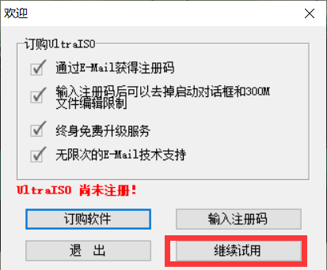

2.3.2 Choose File/文件 in the tool bar and then choose Open/打开


2.3.3 Choose the image file we download before


2.3.4 Start making Startup disk

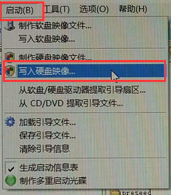

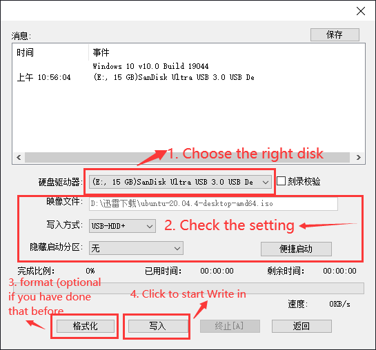


#### Allocate Hard Disk Space


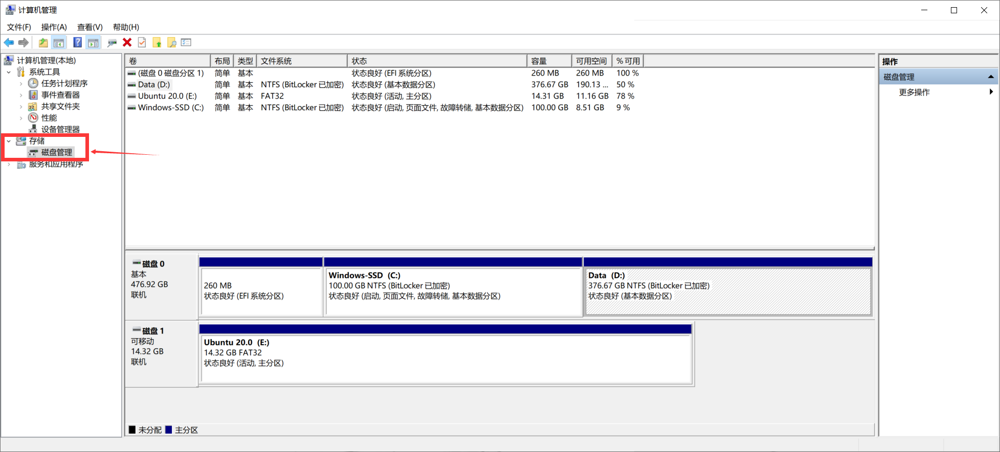


### Installation

The first step to install Ubuntu is to run the Ubuntu live environment. To run the Ubuntu live environment, you have to reboot your PC and load the boot-up menu. Usually, in most of the machines the boot-up menu comes from **“F12”** shortcut key, however, in some machines, the boot-up menu appears from **“ESC”, “F2”, “F10”** key as well. For the actual confirmation, **refer to** the user manual of your machine.

#### Enter boot-up menu

Choose your bootable USB

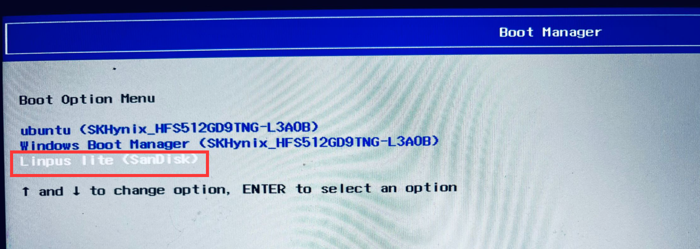

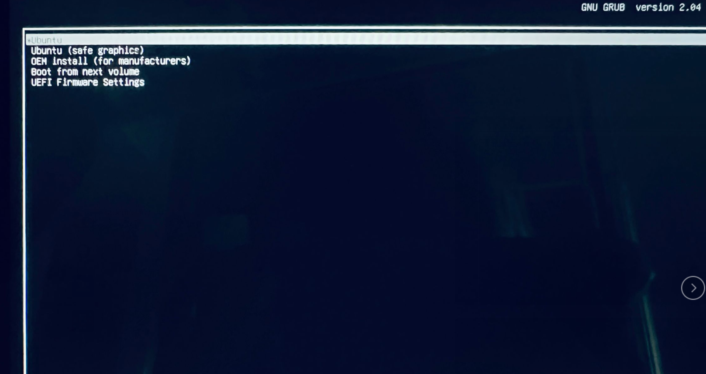

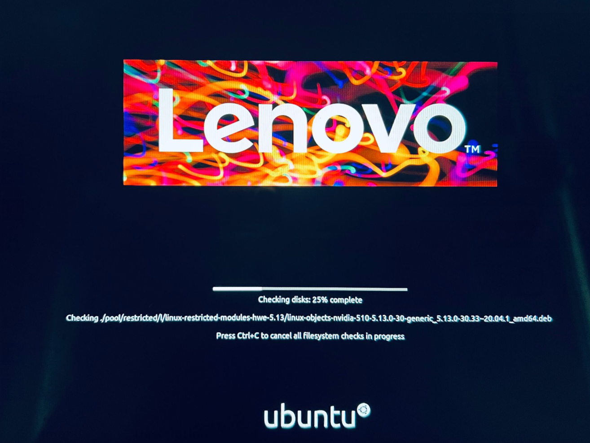

 Once the Ubuntu image has been booted up, we should see the following options. Select ‘Install Ubuntu’

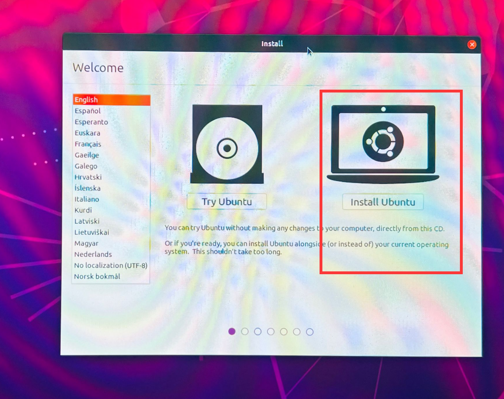

On next screen, we will be asked for ‘Keyboard Layout’, I am leaving it at default, modify it as per your needs & press Continue,

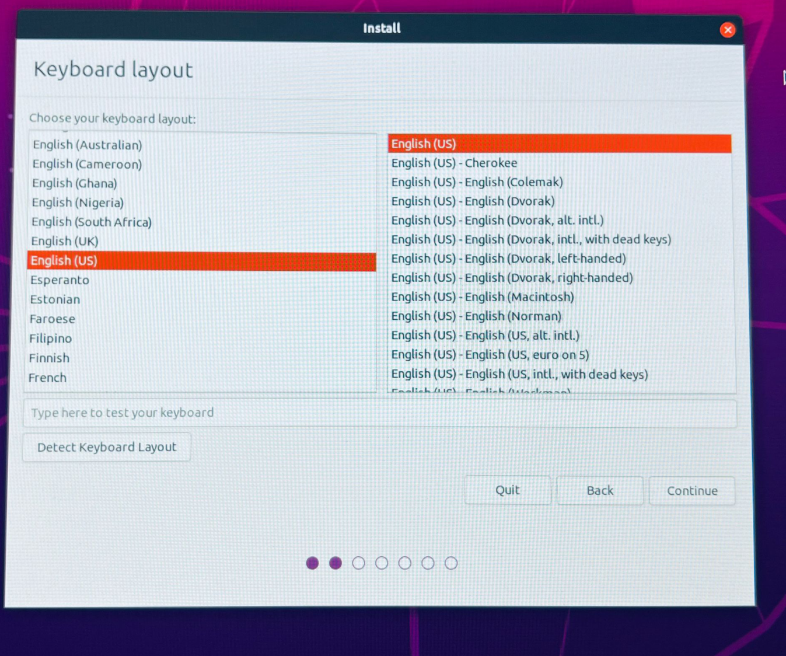

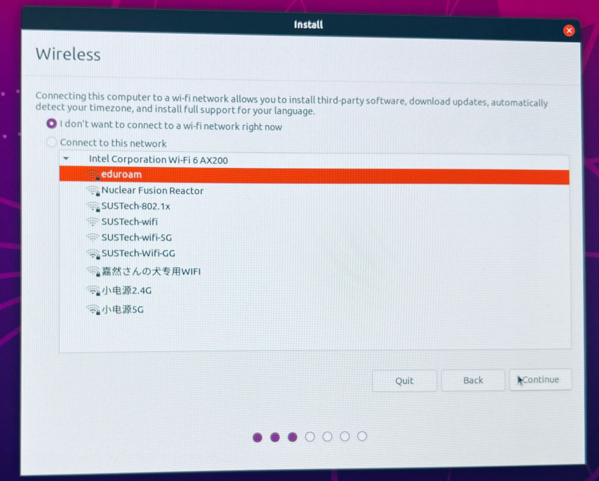

we have an extra option to select what apps we need to install on our system.

we can either select Normal installation with all the default applications,

or we can also select Minimal Installation with only a web browser and some basic utilities. 

Select the option, you see fit & press Continue


#### Setting partitions manually


##### Recommended way:

| /     | Primary | Ext4 | 51200MB | 50G  |
| ----- | ------- | ---- | ------- | ---- |
| /boot | Primary | Ext4 | 2048MB  | 2G   |
| /home | Logical | Ext4 | 51200MB | 50G  |
| /tmp  | Logical | Ext4 | 5120MB  | 5G   |
| /usr  | Logical | Ext4 | 20480MB | 20G  |
| /var  | Logical | Ext4 | 20480MB | 20G  |
| /swap | Logical | Swap | 15655MB | 10G  |
| total |         |      |         | 157G |

You can also allocate the disk yourself according to your free space...

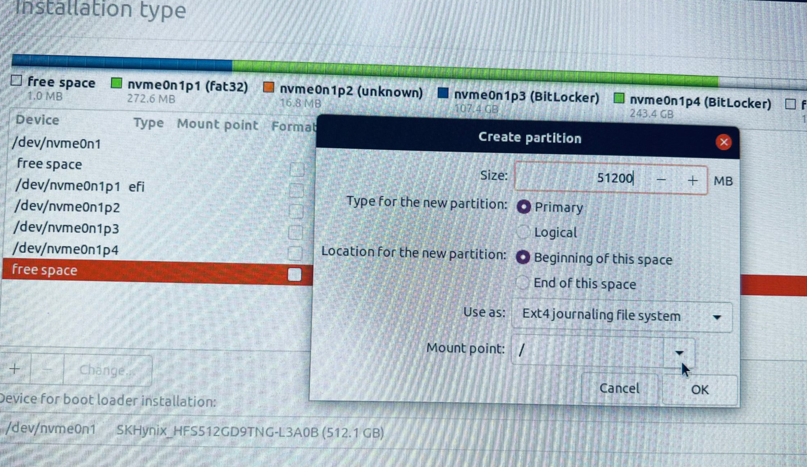

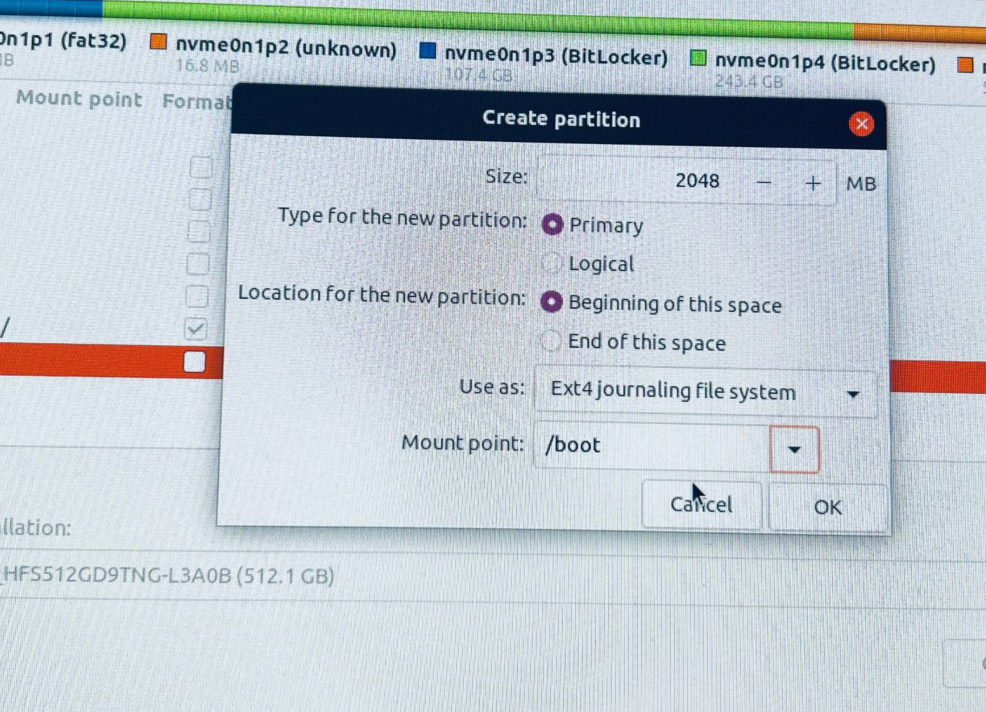

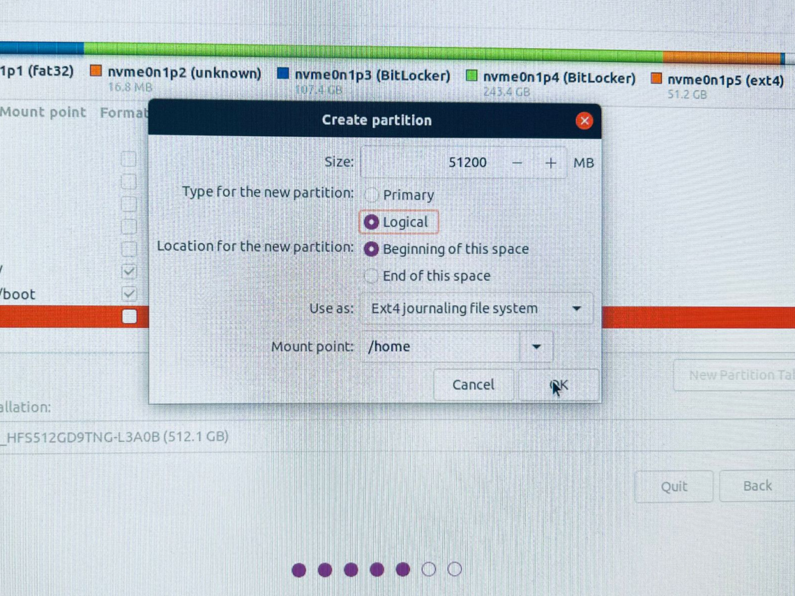


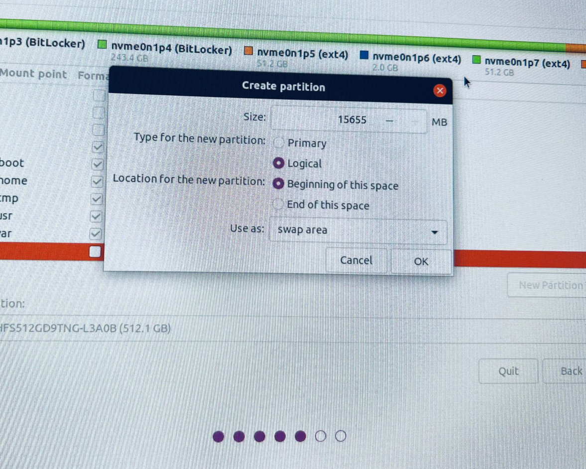


#### Continue installing...

wait until installing finish and then restart your computer


We have now entered all the needed information, Ubuntu will now proceed with the installation & depending on the allocated system resources it can take anywhere between 5 to 20 mins.


Once the installation has been completed, we will be asked to restart our system. Press on ‘Restart Now’. Also **remove** the **installation media** from system before restarting the system.


## Basic Operation of Linux System

### Basic Linux Commands

| No.  | Command  | Description                                           |
| ---- | -------- | ----------------------------------------------------- |
| 1    | pwd      | Display the pathname for the current directory.       |
| 2    | ls       | List directory contents.                              |
| 3    | cd       | Change to directory.                                  |
| 4    | cp       | Copy files and directories.                           |
| 5    | mv       | Rename or move file(s) or directories.                |
| 6    | rm       | Remove (delete) file(s) and/or directories.           |
| 7    | mkdir    | Create a new directory.                               |
| 8    | rmdir    | Remove (delete) empty directories.                    |
| 9    | touch    | Create an empty file with the specified name.         |
| 10   | clear    | Clear a command line screen/window for a fresh start. |
| 11   | find     | Find the file in the specified directory.             |
| 12   | sudo     | A command requires superuser privileges.              |
| 13   | chmod    | Change a file’s permissions.                          |
| 14   | ll       | List the detail directory contents.                   |
| 15   | ifconfig | View or configure a network interface.                |
| 16   | history  | List previously used commands.                        |

**Try it yourself !**

## The basic of C++ & python

#### C++

##### Installation

```
sudo apt-get install build-essential g++
```


##### Verification

```
g++ --version
```


##### IDE

Clion or vscode

#### Python

##### Installation

```
sudo apt-get install python3 python3-venv python3-pip
```

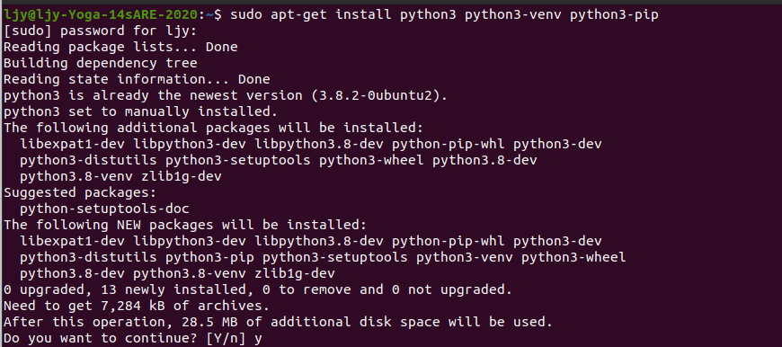

##### Verification

```
python3 --verision
```


##### IDE

PyCharm or vscode

#### 1. if Statement

##### C++

```c++
#include <iostream>
using namespace std;

int main(){
    //local variable declaration
    int a = 100;
    
    //check the boolean condition
    if( a < 20 ){
        //if condition is true then print the following
        cout << "a is less thanb 20" << endl;
    } else{
        //if condition is false then print the following
        cout << "a is not less than 20" << endl;
    }
    cout << "value of a is : " << a << endl;
}
```

##### Python

```python
#!/usr/bin/python
# -*- coding: utf-8 -*-
a = 100
if (a<20):
	print("a is less than 20")
else:
	print("a is not less than 20")
print "value of a is : ", a
```

#### 2. for Statement

##### C++

```c++
#include <iostream>
using namespace std;

int main(){
    int a = 0;
    
    for(a; a<10; a++)
    {
        cout << "a = " << a << endl;
    }
    return 0;
}
```

##### Python

```python
#!/usr/bin/python
# -*- coding: utf-8 -*-
for a in range(10):
    if a < 10:
        print "a = ", a
    else:
        break
```

#### 3. while Statement

##### C++

```c++
#include <iostream>
using namespace std;

int main(){
    int a = 0;
    
    while(a < 10)
    {
        cout << "a = " << a << endl;
        a++;
    }
    return 0;
}
```

##### Python

```python
#!/usr/bin/python
# -*- coding: utf-8 -*-
a = 100
while a < 10:
	print "a = ", a
	a+=1
```

#### 4. class

##### C++

```c++
#include <iostream>
#include <string>
using namespace std;

class Student
{
    static int stuCount;
    string name;
    int id;
    Student(string name, int id){
        this->name = name;
        this->id = id;
    }
    void displayCount()
    {
        cout << "Total Student" << Student::stuCount << endl;
    }
    void displayStudent()
    {
        cout << "Name : " << name << ", ID : " << id << endl;
    }
};
int Student::stuCount = 0;
int main()
{
    Student stu1("Jimmy", 111);
    stu1.displayStudent();
    stu1.displayCount();
    
    Student stu2("Eddy", 222);
    stu2.displayStudent();
    stu2.displayCount();
    return 0;
}

```

##### Python

```python
#!/usr/bin/python
# -*- coding: utf-8 -*-
class Student:
    stuCount = 0
    
    def __init__(self, name, id):
        self.name = name
        self.id = id
        Student.stuCount += 1
        
    def displayCount(self):
        print "Total Student %d" % Student.stuCount
        
    def displayStudent(self):
        print "Name : ", self.name, ", ID : ", self.id
def main():
    stu1 = Student("Jimmy", 111)
    stu1.displayCount()
    stu1.displayStudent()
    
    stu2 = Student("Eddy", 222)
    stu2.displayCount()
    stu2.displayStudent()

if __name__ == "__main__":
    main()
```


## Installing ROS

Refer to http://wiki.ros.org/noetic/Installation/Ubuntu for ROS installation

### 1.1 Setup your `sources.list`

Setup your computer to accept software from packages.ros.org. 

```
sudo sh -c 'echo "deb http://packages.ros.org/ros/ubuntu $(lsb_release -sc) main" > /etc/apt/sources.list.d/ros-latest.list'
```


### 1.2 Setup your keys

if you haven't already installed curl

```
sudo apt install curl
```


```
curl -s https://raw.githubusercontent.com/ros/rosdistro/master/ros.asc | sudo apt-key add -
```


### 1.3 Installation

```
sudo apt update
sudo apt install ros-noetic-desktop-full
```


### 1.4 Environment setup

```
source /opt/ros/noetic/setup.bash
```

To automatically source this script every time a new shell is launched:

```
echo "source /opt/ros/noetic/setup.bash" >> ~/.bashrc
source ~/.bashrc
```


### 1.5 Dependencies for building packages

```
sudo apt install python3-rosdep python3-rosinstall python3-rosinstall-generator python3-wstool build-essential
```


### 1.6 Initialize rosdep

```
sudo apt install python3-rosdep
```

```
sudo rosdep init
rosdep update
```


### Quick Test

Open a new terminal

```
roscore
```

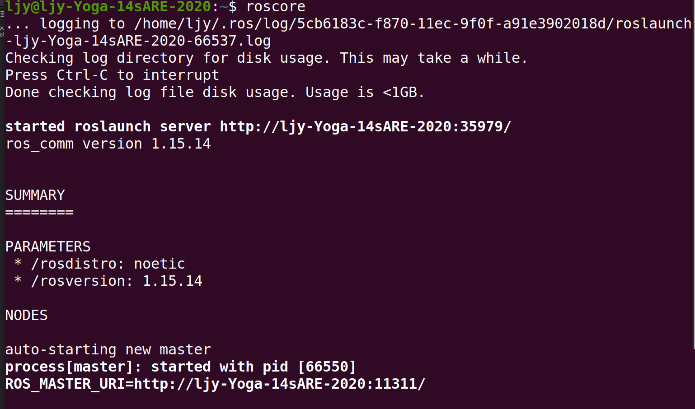

`Ctrl` +`Shift`+`T`  to open a new shell

```
rosrun turtlesim turtlesim_node
```

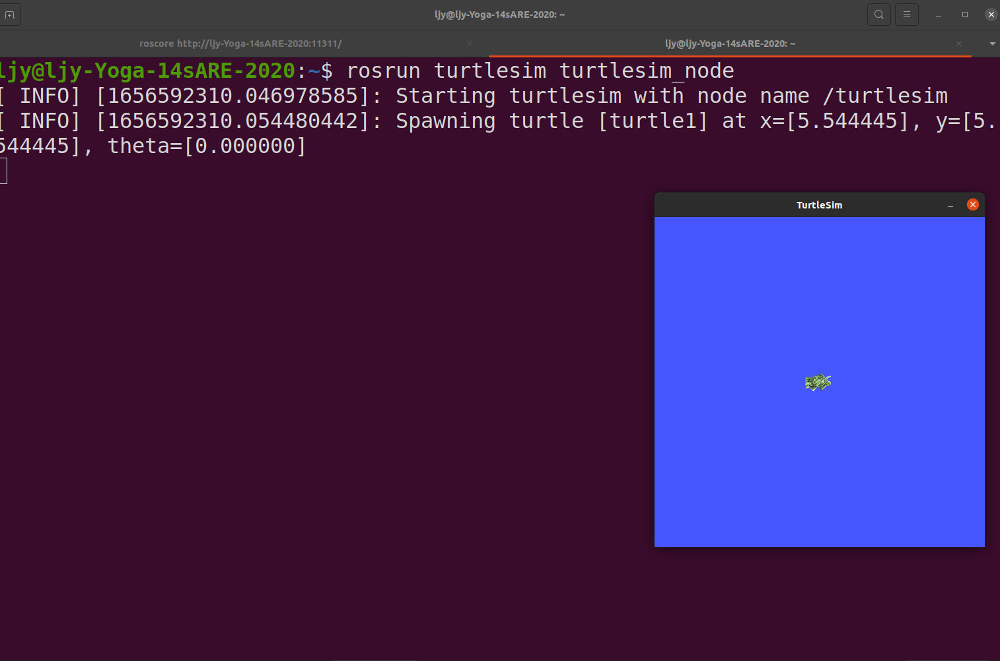

`Ctrl` +`Shift`+`T`  to open a new shell

```
rosrun turtlesim turtle_teleop_key
```


## Lab Task

1. Install Ubuntu on your computer
2. Practice Linux commands
3. [Install ROS](http://wiki.ros.org/noetic/Installation/Ubuntu)
4. [ROS tutorials](http://wiki.ros.org/ROS/Tutorials) (Beginner Level & Intermediate Level)
