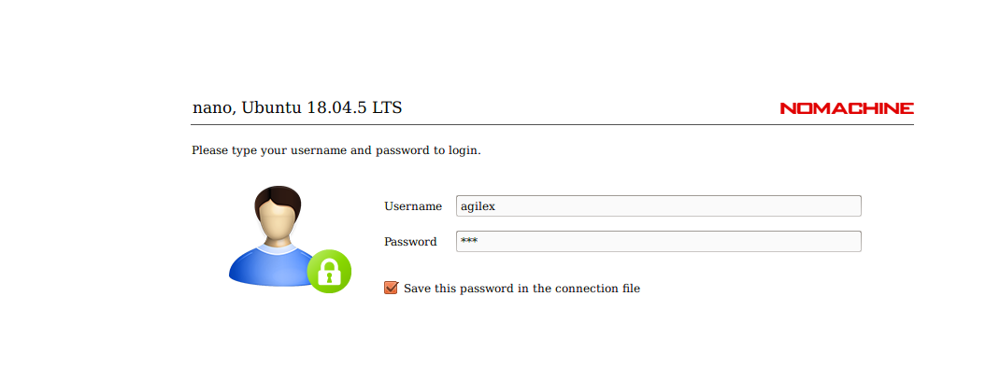
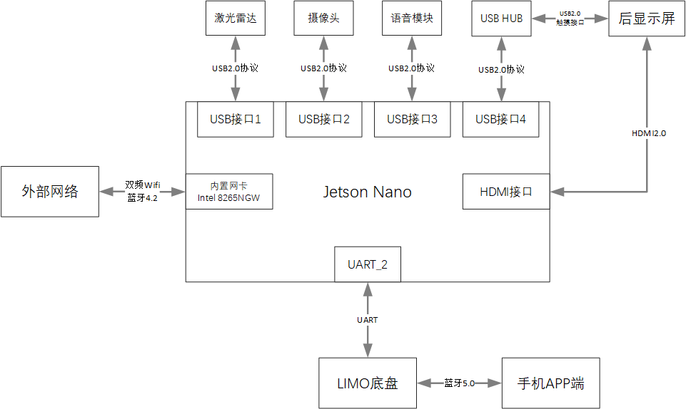
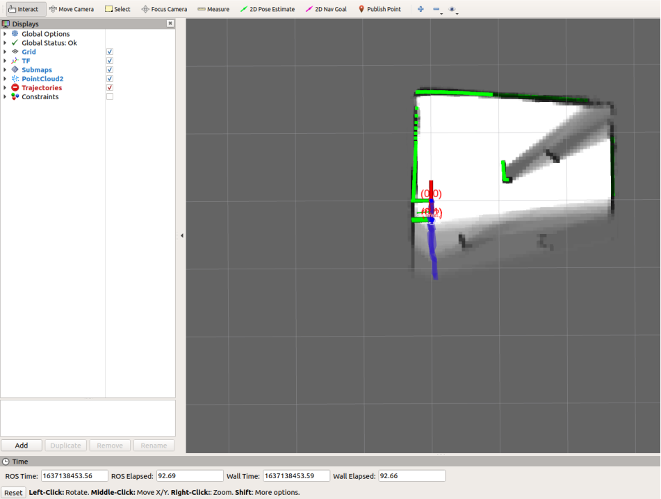
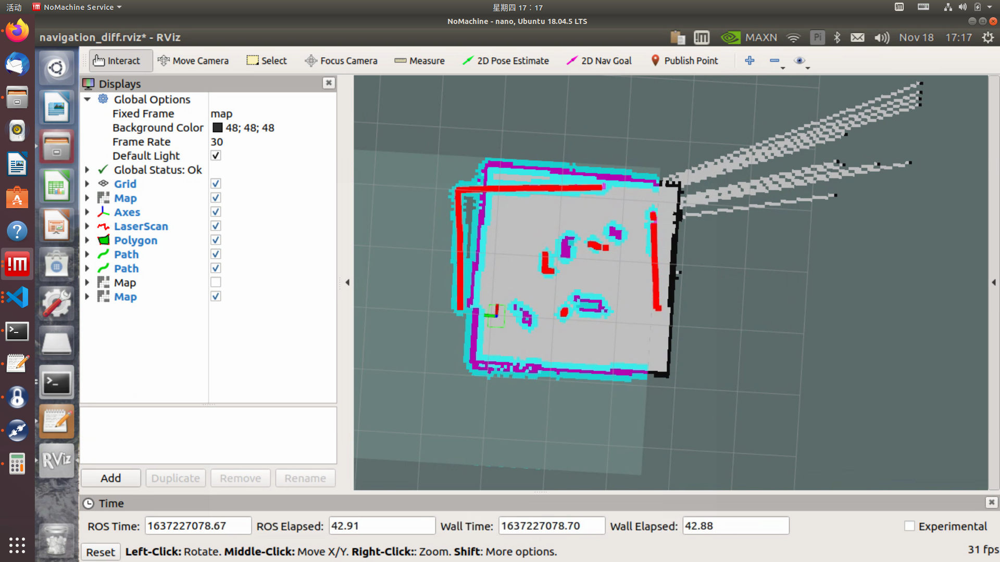
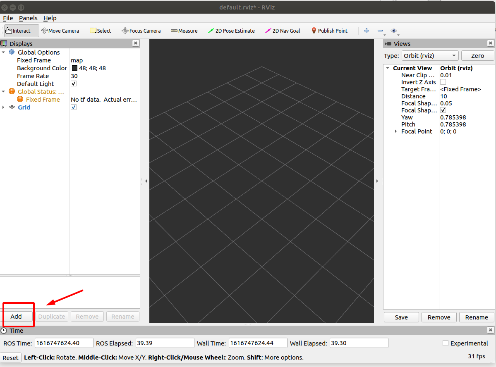

[TOC]

# LIMO 实车使用教程

修改 ：12232434 孙耀威
## 课程目标
1. 将limo小车开机
2. 使用遥控器控制四轮差速与阿克曼模式下的limo小车
3. 通过ros通信/python代码控制limo小车前后左右移动
4. 实现limo小车的gmapping建图
5. 在rviz中显示摄像头，雷达，深度相机数据

## 一、LIMO产品简介

### 1.1 产品列表

| 名称                            | 数量                   |
| ------------------------------- | ---------------------- |
| LIMO高配版主体（安装越野轮 X4） | X1                     |
| 电池                            | X1                     |
| 充电器                          | X1                     |
| 麦克纳姆轮                      | X4                     |
| 履带                            | x2                     |
| APP_Nexus                       | X1                     |
| 内六角螺丝刀                    | X1                     |
| 螺丝                            | M3 12mm x3、M3 5mm x20 |


### 1.2 部件名称


①　WIFI/蓝牙天线；

②　深度相机；

③　前显示器；

④　EAI X2L激光雷达;

⑤　轮毂电机；

⑥　RGB车灯；

⑦　四轮差速/阿克曼模式切换插销；

⑧　电量显示；

⑨　左扬声器；

⑩　左海鸥门；


⑪　后显示器；

⑫　电池门；

⑬　开关；

⑭　右海鸥门；

⑮　右扬声器；

 

⑯　USB-HUB模块；

 

⑰　语音模块；

⑱　工控机NVIDIA Jetson Nano（4G）；

⑲　电池；

### 1.3 功能亮点

使用四个轮毂电机，节省车体内部空间，可在一个车体上实现阿克曼、四轮差速、履带和麦轮这四种模态的快速切换；

（1）车灯状态指示：

两车灯为RGB LED，选用5种对比度高的颜色作为指示灯，其余颜色可供开发者自定义；

| 颜色     | 状态              |
| -------- | ----------------- |
| 红色闪烁 | 低电量/主控报警   |
| 红色常亮 | 程序暂停          |
| 绿色     | 阿克曼模式        |
| 黄色     | 四轮差速/履带模式 |
| 蓝色     | 麦克纳姆轮模式    |

 
### 1.4 模态切换方法

（1）切换阿克曼模式：

先将两侧插销拔起，顺时针转30度，使两插销上较长的线指向车体正前方 ，即可卡住，车灯变为绿色且常亮时，则切换成功；


（2）切换四轮差速模式：

  拔起来顺时针转30度，使两插销上较短的线指向车体正前方，此时为插入状态，微调轮胎角度对准孔位让插销插入，车灯变为黄色且常亮时，则切换成功；

 


### 1.5 操作说明

（1）长按开关键开机（短按暂停程序），观察电量表，最后一颗红灯量时请及时充电或更换电池；


（2）观察前面插销状态以及车灯颜色判断当前模式：


<table>
<tr>
	<td>插销状态</td>
	<td>车灯颜色</td>
	<td>当前模式</td>
</tr>
	<tr>
        <td rowspan="2"> 插入</td> 
        <td>黄色</td>
        <td>四轮差速/履带模式</td>
    </tr>
    <tr>
        <td>蓝色</td>
        <td>麦克纳姆轮模式</td>
    </tr>
<tr>
	<td>拔起</td>
	<td>绿色</td>
	<td>阿克曼</td>
</tr>
</table>


（3）遥控器说明

遥控准备：右滑开机键开机，将SWB通道拨到中间即可遥控控制，下方为指令控制，上方关闭控制；

 


差速模式：将SWD通道拨到中下档位为四轮差速模式，左摇杆控制前进后退，右摇杆控制原地左右转；

 


阿克曼模式：在车体上切换为阿克曼模式，开启遥控器控制即可，左摇杆控制前进后退，右摇杆控制左右方向；

 

该车还具有手机app遥控控制方法，具体参考产品文档

### 1.9 远程桌面连接

#### 1.9.1 下载安装NoMachine

首先在个人电脑下载相应的软件，下载链接：https://www.nomachine.com/download，根据自己电脑的操作系统和架构下载相应的版本。让limo和电脑连接到同一个WIFI下。                         

#### 1.9.2 连接wifi

打开limo右侧的海鸥门，找到USB-HUB模块，给limo连接上键盘鼠标，USB-HUB模块的位置如下图：


键盘鼠标成功连接之后通过以下操作连接wifi，选择需要连接的wifi。


输入wifi的密码


#### 1.9.2 远程连接limo

选择连接对象


点击Yes


Username：agilex   Password：agx 勾选保存密码



一路选择默认OK


## 二、底盘电气信息说明

###  2.1 充电

LIMO默认随车配备一个12.6V 2A的充电器，可满足客户的充电需求，且充电器上设有指示灯可显示充电状态。

------

- 充电时请关机取出电池，将电池输出接口与车体分离。
- 将充电器的充电接头与电池连接，再接通充电器电源进行充电。
- 充满时请先将电池与充电器分离，再断开充电器电源。

------

充电器状态如下表：

| 充电器指示灯颜色 | 电池状态 |
| ---------------- | -------- |
| 红色             | 充电中   |
| 绿色闪烁         | 即将充满 |
| 绿色             | 已充满   |

##### 充电注意事项：

------

- 禁止使用非原装充电器对电池进行充电，请勿在0℃以下给电池充电。

- 充电时必须将电池与LIMO车体分离，禁止在电池充电的同时为LIMO进行供电。
- 当充电器指示灯变为绿色时表示充电完毕，但为了延长电池寿命，充电器会以0.1A的电流进行涓流充电，持续约0.5小时。

- 当前电池从8.25V到充满电状态大约需要2.5小时，电池充满电电压约为12.6V。

### 2.2 使用环境及安全注意事项

------

- LIMO的工作温度为-10℃ ~ 40℃，请勿在温度低于-10℃、高于40℃环境中使用；
- LIMO的使用环境的相对湿度要求是：最大80%，最小30%；
- 请勿在存在腐蚀性、易燃性气体的环境或者靠近可燃性物质的环境中使用；
- LIMO不具有防水功能，请勿在有雨、雪、积水的环境使用；
- 建议使用环境海拔高度不超过1000米、昼夜温差不超过25℃；
- 使用过程有疑问，请按照相关说明手册进行操作或者咨询相关技术人员；
- 请勿未经技术支持和允许，私自改装内部设备结构。

### 2.3 通信拓扑



------

- LIMO底盘内置了蓝牙5.0模块可以与手机端的APP连接，实现遥控功能。
- LIMO与Nano通过UART接口直接连接，Nano通过该接口可实现对底盘的控制。
- USB HUB提供2个USB和1个Type C接口，3个接口均工作在USB2.0协议下。
- 后显示屏通过USB2.0接口与USB HUB相连，起触摸功能。


## 三、底盘驱动程序驱动

移动底盘需要通过程序驱动才能实现limo的导航，limo的底盘驱动程序分为两个版本，分别为C++版本和Python版本，两个版本都可以控制limo运动。

### 3.1 C++底盘驱动

C++版本的驱动程序所在文件夹为~/agilex_ws/src/limo_ros/limo_base，可以通过以下命令进入到该文件夹中

```
cd agilex_ws/src/limo_ros/limo_base
```

以下是limo_base功能包的文件列表：

```
├── limo_base
    ├── CMakeLists.txt
    ├── include
    │   ├── limo_driver.h
    │   ├── limo_protocol.h
    │   └── serial_port.h
    ├── launch
    │   └── limo_base.launch
    ├── msg
    │   └── LimoStatus.msg
    ├── package.xml
    └── src
        ├── limo_base_node.cpp
        ├── limo_driver.cpp
        └── serial_port.cpp
```

limo_base下有四个文件夹，分别为include、launch、msg、src。include文件夹下存放着驱动程序所调用的库文件；launch文件夹下存放着驱动程序的启动文件；msg文件夹下存放着驱动程序所需要的消息文件；src文件夹下存放着驱动程序源代码。

| 文件夹  | 存放文件                 |
| ------- | ------------------------ |
| include | 驱动程序所调用的库文件   |
| launch  | 驱动程序的启动文件       |
| msg     | 驱动程序所需要的消息文件 |
| src     | 驱动程序源代码           |

可以通过一段简单的指令控制limo向前运动

注：在运行命令之前，请确保其他终端中的程序已经终止，终止命令为：Ctrl+c

1、启动底盘，打开一个终端，在终端中输入命令：

```
roslaunch limo_base limo_base.launch
```

2、输入控制指令，打开一个终端，在终端中输入命令：

```
rostopic pub /cmd_vel geometry_msgs/Twist "linear:
  x: 0.2
  y: 0.0
  z: 0.0
angular:
  x: 0.0
  y: 0.0
  z: 0.0" 
```

注：整个命令复制到终端中输入即可，不要手动输入

在终端输入命令之后，limo会先前行走一小段距离，然后停下。

驱动程序源码中使用到的函数：

| 函数名称                     | 函数作用                     |
| ---------------------------- | ---------------------------- |
| connect()                    | 连接底盘                     |
| readData()                   | 读取数据，获取底盘反馈的信息 |
| processRxData()              | 接收串口数据                 |
| parseFrame()                 | 处理串口数据                 |
| sendFrame()                  | 发送串口数据                 |
| setMotionCommand()           | 设置limo的控制模式           |
| enableCommandedMode()        | 使能控制模式                 |
| publishOdometry()            | 发布里程计数据               |
| publishLimoState()           | 发布limo的状态信息           |
| publishIMUData()             | 发布IMU的数据                |
| processErrorCode()           | 错误检测                     |
| twistCmdCallback()           | 发布速度控制数据             |
| normalizeAngle()             | 输出一个正常的角度           |
| degToRad()                   | 把角度转成弧度               |
| convertInnerAngleToCentral() | 将内角转换为中心角           |
| convertCentralAngleToInner() | 将中心角转换为内角           |

### 3.2 Python底盘驱动

limo的Python版本驱动上传到pypi，可以通过pip指令下载该驱动程序；程序的安装目录为~/.local/lib/python3.6/site-packages/pylimo。它的文件列表为：

```
├── __init__.py
├── limomsg.py	
├── limo.py	
└── __pycache__
    ├── __init__.cpython-36.pyc
    ├── limo.cpython-36.pyc
    └── limomsg.cpython-36.pyc
```

Python版本的代码比较简洁，仅有三个文件组成驱动程序，init.py的作用为申明需要使用的文件， limomsg.py的作用为驱动成所需要的消息，limo.py是主程序，它的作用是驱动limo。

| 文件名称   | 文件作用             |
| ---------- | -------------------- |
| init.py    | 申明需要使用的文件   |
| limomsg.py | 驱动成所需要的消息   |
| limo.py    | 主程序，用于驱动limo |

我们提供了一个脚本调用该驱动程序，该脚本所在目录为agilex_ws/src/limo_ros/limo_base/script，脚本名称为limomove.py。

可以通过以下命令访问此目录，打开终端，在终端中输入命令：

注：在运行命令之前，请确保其他终端中的程序已经终止，终止命令为：Ctrl+c

```
cd agilex_ws/src/limo_ros/limo_base/script
```

运行脚本，打开终端，在终端中输入命令：

```
python3 limomove.py
```

在终端输入命令之后，limo会先前行走一段距离，然后停下。

驱动程序中所使用的函数名称：

| 函数名称             | 函数作用         |
| -------------------- | ---------------- |
| EnableCommand()      | 控制使能         |
| SetMotionCommand()   | 设置移动命令     |
| GetLinearVelocity()  | 获取线速度       |
| GetAngularVelocity() | 获取角速度       |
| GetSteeringAngle()   | 获取内转角角度   |
| GetLateralVelocity() | 获取横移速度     |
| GetControlMode()     | 获取控制模式     |
| GetBatteryVoltage()  | 获取电池电量     |
| GetErrorCode()       | 获取错误代码     |
| GetRightWheelOdem()  | 获取左轮里程计   |
| GetLeftWheelOdem()   | 获取右轮里程计   |
| GetIMUAccelData()    | 获取IMU的加速度  |
| GetIMUGyroData()     | 获取陀螺仪的数据 |
| GetIMUYawData()      | 获取IMU的航向角  |
| GetIMUPichData()     | 获取俯仰角       |
| GetIMURollData()     | 获取横滚角       |


## 五、雷达建图

### 5.1 雷达介绍和使用


打开一个新的终端，在终端中输入命令：

```
roslaunch limo_bringup limo_start.launch pub_odom_tf:=false
```

成功打开之后，终端会输出以下日志信息，如图：


然后新开启一个终端，在终端中输入命令：

```
roslaunch limo_bringup lidar_rviz.launch
```

成功运行之后会看到rviz可视化工具打开，其中显示的绿色数据就是雷达扫描出来的激光数据。


这时候可以把遥控器/App调为遥控模式，遥控小车进行移动，这时会看到激光的数据也会跟着变化。

### 5.2 gmapping 建图

#### 5.2.1 gmapping建图算法介绍

Gmapping是基于滤波SLAM框架的常用开源SLAM算法。Gmapping有效利用了车轮里程计信息，对激光雷达的频率要求不高，在构建小场景地图时，所需的计算量较小且精度较高。这里通过使用ROS封装了的GMapping功能包来实现limo的建图。

#### 5.2.2 gmapping建图实践操作

注：在运行命令之前，请确保其他终端中的程序已经终止，终止命令为：Ctrl+c

注：建图过程中limo的速度尽量慢点，速度太快会影响建图的效果

首先需要启动雷达，打开一个新终端，在终端中输入命令：

```
roslaunch limo_bringup limo_start.launch pub_odom_tf:=false
```

然后启动gmapping建图算法，打开另一个新终端，在终端中输入命令：

```
roslaunch limo_bringup limo_gmapping.launch
```

成功启动之后会打开rviz可视化工具，这时候看到的界面如图 


这时候就可以把手柄调为遥控模式，控制limo建图了。

构建完地图之后，需要运行以下命令，把地图保存到指定目录：

1、切换到需要保存地图的目录下，这里把地图保存到~/agilex_ws/src/limo_ros/limo_bringup/maps/，在终端中输入命令：

```
cd ~/agilex_ws/src/limo_ros/limo_bringup/maps/
```

2、切换到/agilex_ws/limo_bringup/maps 之后，继续在终端中输入命令：

```
rosrun map_server map_saver –f map1
```

注：map1为保存地图的名称，保存地图时应避免地图的名称重复

### 5.3 cartographer建图

#### 5.3.1 cartographer建图算法介绍

cartographer是google推出的一套基于图优化的SLAM算法。该算法的主要目标是实现低计算资源消耗，达到实时SLAM的目的。该算法主要分为两个部分，第一个部分称为Local SLAM, 该部分通过一帧帧的Laser Scan建立并维护一系列的Submap，而所谓的submap就是一系列的Grid Map。算法的第二个部分，称为Global SLAM的部分，就是通过Loop Closure来进行闭环检测，来消除累积误差：当一个submap构建完成，也就是不会再有新的laser scan插入到该submap时，算法会将该submap加入到闭环检测中。

#### 5.3.2 cartographer建图实践操作

注：在运行命令之前，请确保其他终端中的程序已经终止，终止命令为：Ctrl+c

注：建图过程中limo的速度尽量慢点，速度太快会影响建图的效果

首先需要启动雷达，打开一个新终端，在终端中输入命令：

```
roslaunch limo_bringup limo_start.launch pub_odom_tf:=false
```

然后启动cartographer建图算法，打开另一个新终端，在终端中输入命令：

```
roslaunch limo_bringup limo_cartographer.launch
```

成功启动之后会弹出rviz可视化界面，如下图：



在构建完地图之后需要保存地图，需要在终端中输入以下三条命令：

（1）完成轨迹, 不接受进一步的数据。

```
rosservice call /finish_trajectory 0
```

（2）序列化保存其当前状态

```
rosservice call /write_state "{filename: '${HOME}/agilex_ws/src/limo_ros/limo_bringup/maps/mymap.pbstream'}"
```

（3）将pbstream转换为pgm和yaml

```
rosrun cartographer_ros cartographer_pbstream_to_ros_map -map_filestem=${HOME}/agilex_ws/src/limo_ros/limo_bringup/maps/mymap.pbstream -pbstream_filename=${HOME}/agilex_ws/src/limo_ros/limo_bringup/maps/mymap.pbstream -resolution=0.05
```

生成对应的pgm和yaml，放于${HOME}/agilex_ws/src/limo_ros/limo_bringup/maps/mymap.pbstream目录下 

注：在建图过程中，终端中会出现一些警告，这是由于速度过快，数据处理不及时造成的，可以忽略


##  六、雷达导航

前面我们使用了两种激光建图方式，接下来利用刚刚构建地图进行导航。

### 6.1 导航框架

导航的关键是机器人定位和路径规划两大部分。针对这两个核心,ROS提供了以下两个功能包。

（1）move_base：实现机器人导航中的最优路径规划。

（2）amcl：实现二维地图中的机器人定位。

在上述的两个功能包的基础上，ROS提供了一套完整的导航框架，


机器人只需要发布必要的传感器信息和导航的目标位置,ROS即可完成导航功能。在该框架中,move_base功能包提供导航的主要运行、交互接口。为了保障导航路径的准确性,机器人还要对自己所处的位置进行精确定位,这部分功能由amcl功能包实现。

#### 6.1.1 move_base 功能包

move_base是ROS中完成路径规划的功能包,主要由以下两大规划器组成。

全局路径规划(global_planner)。全局路径规划是根据给定的目标位置和全局地图进行总体路径的规划。在导航中,使用Dijkstra或A*算法进行全局路径的规划,计算出机器人到目标位置的最优路线,作为机器人的全局路线。

本地实时规划(local_planner)。在实际情况中,机器人往往无法严格按照全局路线行驶,所以需要针对地图信息和机器人附近随时可能出现的障碍物规划机器人每个周期内应该行驶的路线,使之尽量符合全局最优路径。

#### 6.1.2 amcl 功能包

自主定位即机器人在任意状态下都可以推算出自己在地图中所处的位置。ROS为开发者提供了一种自适应(或kld采样)的蒙特卡罗定位方法(amcl), 这是一种概率定位系统，以2D方式对移动机器人定位。 它实现了自适应（或者KLD-采样）蒙特卡洛定位法，使用粒子滤波跟踪机器人在已知地图中的位姿。

#### 6.1.3 DWA_planner和TEB_planner介绍

DWA_planner

DWA 的全称为DynamicWindow Approaches，该算法可以搜索躲避和行进的多条路经,综合各评价标准(是否会撞击障碍物,所需要的时间等)选取最优路径,并且计算行驶周期内的线速度和角速度,避免与动态出现的障碍物发生碰撞。

TEB_planner

“TEB”全称Time Elastic Band（时间弹性带）Local Planner，该方法针对全局路径规划器生成的初始轨迹进行后续修正(modification)，从而优化机器人的运动轨迹，属于局部路径规划。在轨迹优化过程中，该算法拥有多种优化目标，包括但不限于：整体路径长度、轨迹运行时间、与障碍物的距离、通过中间路径点以及机器人动力学、运动学以及几何约束的符合性。“TEB方法”明确考虑了运动状态下时空方面的动态约束，如机器人的速度和加速度是有限制的。

### 6.2 limo导航功能

注：四轮差速模式和全向轮模式、履带模式下，导航运行的文件一样

注：在运行命令之前，请确保其他终端中的程序已经终止，终止命令为：Ctrl+c

（1）首先启动雷达，在终端中输入命令：

```
roslaunch limo_bringup limo_start.launch pub_odom_tf:=false
```

（2）启动导航功能，在终端中输入命令：

```
roslaunch limo_bringup limo_navigation_diff.launch
```

注：如果是阿克曼运动模式，请运行

```
roslaunch limo_bringup limo_navigation_ackerman.launch
```

启动成功之后会打开rviz界面，如图 



注：如需自定义打开的地图，请打开limo_navigation_diff.launch 文件修改参数, 文件所在目录为：~/agilex_ws/src/limo_ros/limo_bringup/launch。请把map02修改为需要更换的地图名称。


（3）开启导航之后，会发现激光扫描出来的形状和地图没有重合，需要我们手动校正，在rviz中显示的地图上矫正底盘在场景中实际的位置，通过rviz中的工具，发布一个大概的位置，给limo一个大致的位置，然后通过手柄遥控limo旋转，让其自动校正，当激光形状和地图中的场景形状重叠的时候，校正完成。操作步骤如图 ：


校正完成后


（4）通过2D Nav Goal 设置导航目标点。


地图中将会生成一条紫色的路径，手柄切换至指令模式，limo将自动导航到目标点


###  6.3 limo路径巡检

（1）首先启动雷达，开启一个新的终端，在终端中输入命令：

```
roslaunch limo_bringup limo_start.launch pub_odom_tf:=false
```

（2）启动导航功能，开启一个新的终端，在终端中输入命令：

```
roslaunch limo_bringup limo_navigation_diff.launch
```

注：如果是阿克曼运动模式，请运行

```
roslaunch limo_bringup limo_navigation_ackerman.launch
```

（3）启动路径记录功能，开启一个新的终端，在终端中输入命令：

```
roslaunch agilex_pure_pursuit record_path.launch
```

路径记录结束之后终止路径记录程序，在终端中输入命令为：Ctrl+c 

（4）启动路径巡检功能，开启一个新的终端，在终端中输入命令：

注：把手柄调至指令模式

```
roslaunch agilex_pure_pursuit pure_pursuit.launch
```


##  七、深度相机+雷达建图

limo拥有两个版本，一个版本搭配RealSense D435，另一个版本搭配ORBBEC®Dabai，两个深度相机都可以实现视觉+雷达的建图导航功能。下面将介绍两个款深度相机的使用方法。

### 7.1 ORBBEC®Dabai的介绍与使用

ORBBEC®Dabai 是基于双目结构光 3D 成像技术的深度相机，主要包括左红外相机(IR camera1)、右红外相机(IR camera2)、一个红外投影仪(IR projector)以及深度计算处理器(depth processor)。红外投影仪用于向目标场景(Scene)投射结构光图案(散斑图案)，左红外相机以及或红外相机分别采集目标的左红外结构光图像以及右红外结构光图像，深度计算处理器接收左红外结构光图像、右红外结构光图像后执行深度计算算法并输出目标场景的深度图像。

| 参数名称                         | 参数指标                                                     |
| -------------------------------- | ------------------------------------------------------------ |
| 左、右红外相机成像中心之间的距离 | 40mm                                                         |
| 深度距离                         | 0.3-3m                                                       |
| 功耗                             | 整机工作平均功耗<2W,<br/>激光开启瞬间峰值 <5W(持续时间 3ms),<br/>待机功耗典型值为<0.7W |
| 深度图分辨率                     | 640*400@30FPS<br/>320*200@30FPS                              |
| 彩色图分辨率                     | 1920X1080@30FPS<br/>1280X720@30FPS<br/>640X480@30FPS         |
| 精度                             | 6mm@1m(81%FOV区域参与精度计算*)                              |
| 深度 FOV                         | H 67.9° V 45.3°                                              |
| 彩色 FOV                         | H 71° V43.7° @1920X1080                                      |
| 延迟                             | 30-45ms                                                      |
| 数据传输                         | USB2.0 或以上                                                |
| 支持操作系统                     | Android / Linux / Windows7/10                                |
| 供电方式                         | USB                                                          |
| 工作温度                         | 10°C ~ 40°C                                                  |
| 适用场景                         | 室内 / 室外(具体以应用场景和相关算法要求为准)                |
| 防尘防水                         | 基础防尘                                                     |
| 安全性                           | Class1 激光                                                  |
| 尺寸(毫米)                       | 长59.6X宽17.4X厚11.1mm                                       |

了解ORBBEC®Dabai的基本参数之后，开始实践操作

注：在运行命令之前，请确保其他终端中的程序已经终止，终止命令为：Ctrl+c 

首先启动ORBBEC®Dabai摄像头，运行下面的命令：

```
roslaunch astra_camera dabai_u3.launch
```

运行过程中会出现以下警告，这是由于驱动中的一些参数摄像头不支持，可以忽略。


### 7.2 realsense的介绍与使用

双目视觉传感器，在机器人视觉测量、视觉导航等机器人行业方向中均有大范围的应用场景和需求，目前我们甄选了了在科研教育行业常见的视觉传感器。英特尔实感深度摄像头 D435 配备全局图像快门和宽视野，能够有效地捕获和串流移动物体的深度数据，从而为移动原型提供高度准确的深度感知。

|              | 型号                 | Intel Realsense D435 |
| ------------ | -------------------- | -------------------- |
| 基本特征     | 应用场景             | 户外/室内            |
| 测量距离     | 约10米               |                      |
| 深度快门类型 | 全局快门/3um X 3um   |                      |
| 是否支持IMU  | 否                   |                      |
| 深度相机     | 深度技术             | 有源红外             |
| FOV          | 86° x 57°（±3°）     |                      |
| 最小深度距离 | 0.105m               |                      |
| 深度分辨率   | 1280 x 720           |                      |
| 最大测量距离 | 约10米               |                      |
| 深度帧率     | 90 fps               |                      |
| RGB          | 分辨率               | 1280 x 800           |
| FOV          | 69.4° × 42.5°（±3°） |                      |
| 帧率         | 30fps                |                      |
| 其他信息     | 尺寸                 | 90mm x 25mm x 25mm   |
| 接口类型     | USB-C 3.1            |                      |

了解realsense的基本参数之后，开始实践操作

 注：在运行命令之前，请确保其他终端中的程序已经终止，终止命令为：Ctrl+c

首先启动realsense摄像头，运行下面的命令：

```
roslaunch realsense2_camera rs_camera.launch
```

当终端中出现下面的日志信息，摄像头就启动成功了。


### 7.3 查看深度相机信息

成功打开深度相机之后，接下来启动rviz，查看深度相机所拍摄到的图像和采集的深度信息。

开启一个新终端，输入命令：

```
rviz
```

然后添加Image组件就能看到摄像头所拍摄的画面，操作步骤如下。




Fixed frame选择camera_link


image组件填入对应的话题获取rgb图片


完成上述操作之后就能在Image窗口看到摄像头拍摄的画面了。


如果想要查看点云数据，点击add添加DepthCloud组件


fixed frame选择camera_link, DepthCloud组件选择对应的话题


显示深度图


### 7.2 rtabmap算法介绍

rtabmap算法提供一个与时间和尺度无关的基于外观的定位与构图解决方案。针对解决大型环境中的在线闭环检测问题。方案的思想在于为了满足实时性的一些限制，闭环检测是仅仅利用有限数量的一些定位点，同时在需要的时候又能够访问到整个地图的定位点。

### 7.3 rtabmap算法建图

注：在运行命令之前，请确保其他终端中的程序已经终止，终止命令为：Ctrl+c

注：建图过程中limo的速度尽量慢点，速度太快会影响建图的效果

（1）启动雷达，在终端中输入命令：

```
roslaunch limo_bringup limo_start.launch pub_odom_tf:=true
```

（2）启动realsense，在终端中输入命令：

```
roslaunch realsense2_camera rs_camera.launch align_depth:=true
```

注：如果limo搭载ORBBEC®Dabai，请输入命令：

```
 roslaunch astra_camera dabai_u3.launch 
```

（3）启动rtabmap算法的建图模式，在终端中输入命令：

```
roslaunch limo_bringup limo_rtabmap_realsense.launch
```

注：如果limo搭载ORBBEC®Dabai，请输入命令：

```
roslaunch limo_bringup limo_rtabmap_orbbec.launch
```

（4）启动rviz查看建图效果，在终端中输入命令：

```
 roslaunch limo_bringup rtabmap_rviz.launch 
```

当rviz界面中出现如图 的画面时，rtabmap算法建图模式成功启动


当构建完地图之后，可以直接终止程序，构建的地图将自动保存在主目录下的.ros文件中，文件名称为rtabmap.db。.ros文件夹为隐藏文件夹，需要通过Ctrl+h指令显示出来。

### 7.4 rtabmap算法导航

注：在运行命令之前，请确保其他终端中的程序已经终止，终止命令为：Ctrl+c

（1）启动雷达，在终端中输入命令：

```
roslaunch limo_bringup limo_start.launch pub_odom_tf:=true
```

（2）启动realsense，在终端中输入命令：

```
roslaunch realsense2_camera rs_camera.launch align_depth:=true
```

注：如果limo搭载ORBBEC®Dabai，请输入命令：

```
 roslaunch astra_camera dabai_u3.launch 
```

（3）启动rtabmap算法的定位模式，在终端中输入命令：

```
roslaunch limo_bringup limo_rtabmap.launch localization:=true
```

注：如果limo搭载ORBBEC®Dabai，请输入命令：

```
roslaunch limo_bringup limo_rtabmap_orbbec.launch localization:=true
```

（4）启动move_base，在终端中输入命令：

```
roslaunch limo_bringup limo_navigation_rtabmap.launch
```

注：如果是阿克曼运动模式，请运行

```
roslaunch limo_bringup limo_navigation_rtabmap_ackerman.launch
```

（5）启动rviz查看建图效果，在终端中输入命令：

```
 roslaunch limo_bringup rtabmap_rviz.launch 
```

（6）因为我们用到视觉定位，所以在采用rtabmap导航的时候不需要校正，可以直接开始设置目标点进行导航，操作步骤如图 。


地图中将会生成一条绿色的路径，手柄切换至指令模式，limo将自动导航到目标点


 

## 八、 视觉模块


### 8.2 识别红绿灯

#### 8.2.1 功能简介

通过darknet_ros进行红绿灯目标检测之后，要对红绿灯进行灯色识别并进行在三维空间中的定位，生成物体相对与摄像机的位置关系。该方式只能实现对红绿灯的识别和定位，无法获得红绿灯姿态。需要使用深度摄像机，其识别距离取决于深度摄像头范围。

#### 8.1.2 运行功能

注：在运行命令之前，请确保其他终端中的程序已经终止，终止命令为：Ctrl+c

以Realsense为例子，启动realsense深度相机，在终端中输入命令：

```
 roslaunch realsense2_camera rs_camera.launch
```

注：如果limo搭载ORBBEC®Dabai，请输入命令：

```
 roslaunch astra_camera dabai_u3.launch 
```

启动yolo_v3，在终端中输入命令：

```
 roslaunch darknet_ros  yolo_v3_tiny.launch
```

启动红绿灯识别功能

```
 roslaunch vision traffic_light_located.launch
```


