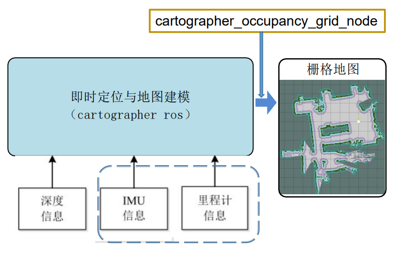
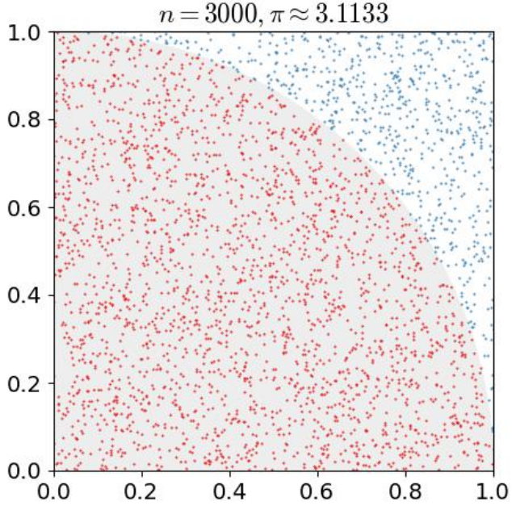
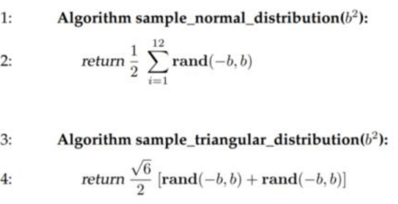
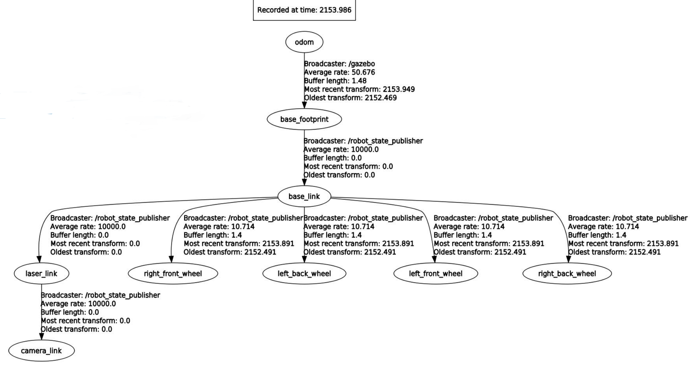
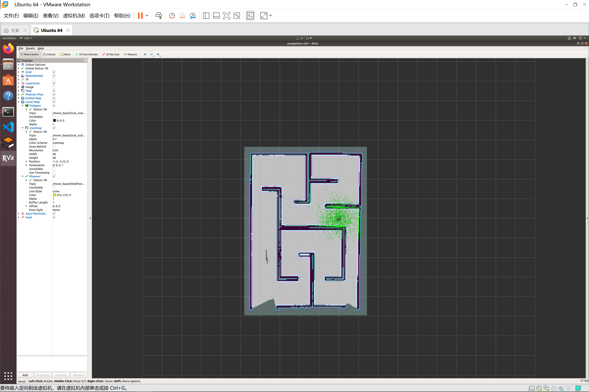

# IR_LAB 9 Tutorial

## Comparison of three SLAM(gmapping、hector、cartographer) algorithms

### Gmapping

#### 1、Introduction

1) 基于激光雷达
2) Rao-Blackwellized粒子滤波算法
3) 二维栅格网络
4) 需要机器人提供里程计信息
5) OpenSlam开源算法
6) 输出地图话题：nav_msgs/OccupancyGrid


论文可参考：http://openslam.org/gmapping/html

#### 2、Code for turtlebot3

You can create a launch file with the following code and run it in your world with turtlebot3.
```html
<launch>
	<!-- Arguments -->
	<arg name="model" default="$(env TURTLEBOT3_MODEL)" doc="model type [burger, waffle, waffle_pi]"/>
	<arg name="configuration_basename" default="turtlebot3_lds_2d.lua"/>
	<arg name="set_base_frame" default="base_footprint"/>
	<arg name="set_odom_frame" default="odom"/>
	<arg name="set_map_frame"  default="map"/>
	<arg name="multi_robot_name" default=""/>
	<arg name="open_rviz" default="true"/>

	<!-- TurtleBot3 -->
	<arg name="urdf_file" default="$(find xacro)/xacro --inorder '$(find turtlebot3_description)/urdf/turtlebot3_$(arg model).urdf.xacro'" />
	<param name="robot_description" command="$(arg urdf_file)" />

	<node pkg="robot_state_publisher" type="robot_state_publisher" name="robot_state_publisher">
		<param name="publish_frequency" type="double" value="50.0" />
		<param name="tf_prefix" value="$(arg multi_robot_name)"/>
	</node>

	<!-- Gmapping -->
	<node pkg="gmapping" type="slam_gmapping" name="turtlebot3_slam_gmapping" output="screen">
		<param name="base_frame" value="$(arg set_base_frame)"/>
		<param name="odom_frame" value="$(arg set_odom_frame)"/>
		<param name="map_frame"  value="$(arg set_map_frame)"/>
		<rosparam command="load" file="$(find turtlebot3_slam)/config/gmapping_params.yaml" />
	</node>

	<!-- rviz -->
	<group if="$(arg open_rviz)"> 
		<node pkg="rviz" type="rviz" name="rviz" args="-d $(find pokemon_navigation)/config/single.rviz"/>
	</group>

</launch>
```
#### 3、Result:


### Hector_slam

#### 1、Introduction
1) 基于激光雷达
2) 高斯牛顿法
3) 二维栅格网络
4) 不需要里程计数据
5) 输出地图话题：nav_msgs/OccupancyGrid


#### 2、Topics and services of hector


#### 3、Tf transform of hector


#### 4、Install hector_slam

Package installation

`sudo apt-get install ros-noetic-hector-mapping`

Source installation
`For source installation, https://github.com/tu-darmstadt-ros-pkg/hector_slam.git`

#### 5、Code for smartcar

##### 1) Configure hector

Create launch file
`cd ~/smartcar/src/smartcar_slam/launch`

`touch smartcar_hector.launch`

Code:
```html
<launch>
	<node pkg = "hector_mapping" type="hector_mapping" name="hector_mapping" output="screen">
		<!-- Frame names-->
		<param name="pub_map _odom_transform" value="true"/>
		<param name="map_frame" value="map" />
		<param name="base_frame" value="base_footprint" />
		<param name="odom_frame" value="odom" />

		<!--Tf use-->
		<param name="use_tf_scan_transformation" value="true"/>
		<param name="use_tf_pose_start_estimate" value="false"/>

		<!--Map size/start point-->
		<param name="map_resolution" value="0.05"/>
		<param name="map_size" value="2048"/>
		<param name="map＿start_x" value="0.5"/>
		<param name="map_start_y" value="0.5" />
		<param name="laser_z min_value" value = "-1.0" />
		<param name="laser_z_max_value" value ="1.0"/>
		<param name="map_multi_res_levels" value="2" />

		<param name="map_pub_period" value="2" />
		<param name="laser_min_dist" value="0.4"/>
		<param name="laser_max_dist" value="5.5" />
		<param name="output_timing" value="false" />
		<param name="pub_map_scanmatch_transform" value="true" />

		<!--Map update parameters-->
		<param name="update_factor_free" value="0.4"/>
		<param name="update_factor _occupied" value="0.7" />
		<param name="map_update_distance_thresh" value="0.2"/>
		<param name="map_update_angle_thresh" value="0.06"/>

		<!--Advertising config-->
		<param name="advertise_ map_service" value="true"/>
		<param name="scan_subscriber_queue_size" value="5"/>
		<param name="scan_topic" value="scan"/>
	</node>

</launch>
```
##### 2) Running hector_slam in Simulation

`roslaunch smartcar_gazebo smartcar_with_laser_nav.launch`

`roslaunch smartcar_slam smartcar_hector.launch`

`roslaunch smartcar_teleop smartcar_teleop.launch`

##### 3) Save map

Code:
```html
<launch>
	<arg name="filename" value="$(find smartcar_slam/map/maze_hector)"/>
	<node name = "map_save" pkg="map_server" type="map_saver" args="-f $(aarg filename)"/>
</launch>
```
Run following to save map
`roslaunch smartcar_slam smartcar_savemap.launch`

#### 6、Code for turtlebot3

You can create a launch file with the following code and run it in your world with turtlebot3.
```html
<launch>
	<!-- Arguments -->
	<arg name="model" default="$(env TURTLEBOT3_MODEL)" doc="model type [burger, waffle, waffle_pi]"/>
	<arg name="configuration_basename" default="turtlebot3_lds_2d.lua"/>
	<arg name="odom_frame" default="odom"/>
	<arg name="base_frame" default="base_footprint"/>
	<arg name="scan_subscriber_queue_size" default="5"/>
	<arg name="scan_topic" default="scan"/>
	<arg name="map_size" default="2048"/>
	<arg name="pub_map_odom_transform" default="true"/>
	<arg name="tf_map_scanmatch_transform_frame_name" default="scanmatcher_frame"/>
	<arg name="multi_robot_name" default=""/>

	<!-- TurtleBot3 -->
	<arg name="urdf_file" default="$(find xacro)/xacro --inorder '$(find turtlebot3_description)/urdf/turtlebot3_$(arg model).urdf.xacro'" />
	<param name="robot_description" command="$(arg urdf_file)" />

	<node pkg="robot_state_publisher" type="robot_state_publisher" name="robot_state_publisher">
		<param name="publish_frequency" type="double" value="50.0" />
		<param name="tf_prefix" value="$(arg multi_robot_name)"/>
	</node>

	<!-- Hector mapping -->
	<node pkg="hector_mapping" type="hector_mapping" name="hector_mapping" output="screen">
		<!-- Frame names -->
		<param name="map_frame"  value="map" />
		<param name="odom_frame" value="$(arg odom_frame)" />
		<param name="base_frame" value="$(arg base_frame)" />

		<!-- Tf use -->
		<param name="use_tf_scan_transformation"  value="true"/>
		<param name="use_tf_pose_start_estimate"  value="false"/>
		<param name="pub_map_scanmatch_transform" value="true" />
		<param name="pub_map_odom_transform"      value="$(arg pub_map_odom_transform)"/>
		<param name="tf_map_scanmatch_transform_frame_name" value="$(arg tf_map_scanmatch_transform_frame_name)" />

		<!-- Map size / start point -->
		<param name="map_resolution" value="0.050"/>
		<param name="map_size"       value="$(arg map_size)"/>
		<param name="map_start_x"    value="0.5"/>
		<param name="map_start_y"    value="0.5" />
		<param name="map_multi_res_levels" value="2" />

		<!-- Map update parameters -->
		<param name="update_factor_free"         value="0.4"/>
		<param name="update_factor_occupied"     value="0.9" />   
		<param name="map_update_distance_thresh" value="0.1"/>
		<param name="map_update_angle_thresh"    value="0.04" />
		<param name="map_pub_period"             value="2" />
		<param name="laser_z_min_value"          value= "-0.1" />
		<param name="laser_z_max_value"          value= "0.1" />
		<param name="laser_min_dist"             value="0.12" />
		<param name="laser_max_dist"             value="3.5" />

		<!-- Advertising config -->
		<param name="advertise_map_service"      value="true"/> 
		<param name="scan_subscriber_queue_size" value="$(arg scan_subscriber_queue_size)"/>
		<param name="scan_topic" value="$(arg scan_topic)"/>

		<!-- Debug parameters -->
		<!--
		<param name="output_timing"    value="false"/>
		<param name="pub_drawings"     value="true"/>
		<param name="pub_debug_output" value="true"/>
		-->
	</node>
</launch>
```
#### 7、Result


#### 8、hector_slam过程中会出现打滑显现


### Cartographer

#### 1、Introduction

1) 2016年10月5日，谷歌开源
2) 二维或三维条件下的定位及建图功能
3) 设计目的是在计算资源有限的情况下，实时获取相对较高精度的2D地图
4) cartographer采用基于图网络的优化方法
5) 目前cartographer主要基于激光雷达来实现SLAM
6) 谷歌希望通过后续的开发及社区的贡献支持更多的传感器和机器人平台，同时不断增加新的功能



相关链接

https://github.com/googlecartographer/cartographer_turtlebot

https://google-cartographer-ros.readthedocs.io/en/latest/

http://wiki.ros.org/cartographer

#### 2、Install cartographer

Package installation
`sudo apt-get install ros-noetic-cartographer-*`

#### 3、Code for smartcar

##### 1) Configure cartographer

Create launch file
`cd ~/smartcar/src/smartcar_slam/launch`

`touch smartcar_cartographer.launch`

Code
```html
<launch>
	<param name="/use_sim_time" value="true" />
	<node name="cartographer_node" pkg="cartographer_ros" type="cartographer_node" args="-configuration_directory $(find smartcar_slam)/config -configuration_basename lidar.lua" output="screen">
		<remap from="scan" to="scan" />
	</node>

	<!--cartographer_occupancy_grid_node-->
	<node pkg="cartographer_ros" type="cartographer_occupancy_grid_node" name="cartographer_occupancy grid_node" args="-resolution 0.05" />

	<node name="rviz" pkg="rviz" type="rviz" required="true" args="-d$(find cartographer_ros)/configuration_files/demo_2d.rviz" />
</launch>
```

##### 2)Parameter configuration

File path
`~/smartcar_ws/src/smartcar_slam/config/lidar.lua`

Code
```c
-- Copyright 2016 The Cartographer Authors
--
-- Licensed under the Apache License, Version 2.0 (the "License");
-- you may not use this file except in compliance with the License.
-- You may obtain a copy of the License at
--
-- http://www.apache.org/licenses/LICENSE-2.0
--
-- Unless required by applicable law or agreed to in writing, software
-- distributed under the License is distributed on an "AS IS" BASIS,
-- WITHOUT WARRANTIES OR CONDITIONS OF ANY KIND, either express or implied.
-- See the License for the specific language governing permissions and
-- limitations under the License.

include "map_builder.lua"
include "trajectory_builder.lua"

options = {
	map_builder = MAP_BUILDER,
	trajectory_builder = TRAJECTORY_BUILDER,
	map_frame = "map",
	tracking_frame = "base_footprint",
	published_frame = "base_footprint",
	odom_frame = "odom",
	provide_odom_frame = true,
	publish_frame_projected_to_2d = false,
	use_odometry = true,
	use_nav_sat = false,
	use_landmarks = false,
	num_laser_scans = 1,
	num_multi_echo_laser_scans = 0,
	num_subdivisions_per_laser_scan = 1,
	num_point_clouds = 0,
	lookup_transform_timeout_sec = 0.2,
	submap_publish_period_sec = 0.3,
	pose_publish_period_sec = 5e-3,
	trajectory_publish_period_sec = 30e-3,
	rangefinder_sampling_ratio = 1.,
	odometry_sampling_ratio = 1.,
	fixed_frame_pose_sampling_ratio = 1.,
	imu_sampling_ratio = 1.,
	landmarks_sampling_ratio = 1.,
}

MAP_BUILDER.use_trajectory_builder_2d = true

TRAJECTORY_BUILDER_2D.submaps.num_range_data = 35
TRAJECTORY_BUILDER_2D.min_range = 0.3
TRAJECTORY_BUILDER_2D.max_range = 8
TRAJECTORY_BUILDER_2D.missing_data_ray_length = 1.
TRAJECTORY_BUILDER_2D.use_imu_data = false
TRAJECTORY_BUILDER_2D.use_online_correlative_scan_matching = true
TRAJECTORY_BUILDER_2D.real_time_correlative_scan_matcher.linear_search_window = 0.1
TRAJECTORY_BUILDER_2D.real_time_correlative_scan_matcher.translation_delta_cost_
weight = 10.
TRAJECTORY_BUILDER_2D.real_time_correlative_scan_matcher.rotation_delta_cost_wei
ght = 1e-1

POSE_GRAPH.optimization_problem.huber_scale = 1e2
POSE_GRAPH.optimize_every_n_nodes = 35
POSE_GRAPH.constraint_builder.min_score = 0.65

return options
```

##### 3) Running Cartographer in Simulation

`roslaunch smartcar_gazebo smartcar_with_laser_nav.launch`

`roslaunch smartcar_slam smartcar_cartographer.launch`

`roslaunch smartcar_teleop smartcar_teleop.launch`

##### 4) Save map

Code:
```html
<launch>
	<arg name="filename" value="$(find smartcar_slam/map/maze_cartographer)"/>
	<node name = "map_save" pkg="map_server" type="map_saver" args="-f $(aarg filename)"/>
</launch>
```
Run following to save map
`roslaunch smartcar_slam smartcar_savemap.launch`

#### 4、Code for turtlebot3

You can create a launch file with the following code and run it in your world with turtlebot3.
```html
<launch>
	<!-- Arguments -->
	<arg name="model" default="$(env TURTLEBOT3_MODEL)" doc="model type [burger, waffle, waffle_pi]"/>
	<arg name="configuration_basename" default="turtlebot3_lds_2d_gazebo.lua"/>
	<arg name="multi_robot_name" default=""/>
	<arg name="cmd_vel_topic" default="/cmd_vel" />
	<arg name="odom_topic" default="odom" />
	<arg name="move_forward_only" default="false"/>

	<!-- TurtleBot3 -->
	<arg name="urdf_file" default="$(find xacro)/xacro --inorder '$(find turtlebot3_description)/urdf/turtlebot3_$(arg model).urdf.xacro'" />
	<param name="robot_description" command="$(arg urdf_file)" />

	<node pkg="robot_state_publisher" type="robot_state_publisher" name="robot_state_publisher">
		<param name="publish_frequency" type="double" value="50.0" />
		<param name="tf_prefix" value="$(arg multi_robot_name)"/>
	</node>

	<!-- move_base -->
	<node pkg="move_base" type="move_base" respawn="false" name="move_base" output="screen">
		<param name="base_local_planner" value="dwa_local_planner/DWAPlannerROS" />
		<rosparam file="$(find turtlebot3_navigation)/param/costmap_common_params_$(arg model).yaml" command="load" ns="global_costmap" />
		<rosparam file="$(find turtlebot3_navigation)/param/costmap_common_params_$(arg model).yaml" command="load" ns="local_costmap" />
		<rosparam file="$(find turtlebot3_navigation)/param/local_costmap_params.yaml" command="load" />
		<rosparam file="$(find turtlebot3_navigation)/param/global_costmap_params.yaml" command="load" />
		<rosparam file="$(find turtlebot3_navigation)/param/move_base_params.yaml" command="load" />
		<rosparam file="$(find turtlebot3_navigation)/param/dwa_local_planner_params_$(arg model).yaml" command="load" />
		<remap from="cmd_vel" to="$(arg cmd_vel_topic)"/>
		<remap from="odom" to="$(arg odom_topic)"/>
		<param name="DWAPlannerROS/min_vel_x" value="0.0" if="$(arg move_forward_only)" />
	</node>

	<!-- cartographer_node -->
	<node pkg="cartographer_ros" type="cartographer_node" name="cartographer_node" args="-configuration_directory $(find turtlebot3_slam)/config -configuration_basename $(arg configuration_basename)" output="screen">
		<remap from="/imu" to="/flat_imu"/>
	</node>

	<!-- cartographer_occupancy_grid_node -->
	<node pkg="cartographer_ros" type="cartographer_occupancy_grid_node" name="cartographer_occupancy_grid_node"  args="-resolution 0.05" />

	<!-- flat_world_imu_node -->
	<node pkg="turtlebot3_slam" type="flat_world_imu_node" name="flat_world_imu_node" output="screen">
		<remap from="imu_in" to="/imu" />
		<remap from="imu_out" to="/flat_imu" />
	</node>
</launch>
```

#### 5、Result


## Localization

### Introduction
智能机器人五点关键技术
1、全局地图
2、自身定位
3、路径规划
4、运动控制
5、环境感
机器人导航实现与无人驾驶类似，关键技术也是由上述五点组成，只是无人驾驶是基于室外的，而我们当前介绍的机器人导航更多是基于室内的。

所谓定位就是推算机器人自身在全局地图中的位置，当然，SLAM中也包含定位算法实现，不过SLAM的定位是用于构建全局地图的，是属于导航开始之前的阶段，而当前定位是用于导航中，导航中，机器人需要按照设定的路线运动，通过定位可以判断机器人的实际轨迹是否符合预期。在ROS的导航功能包集navigation中提供了 amcl 功能包，用于实现导航中的机器人定位。


相关链接

http://wiki.ros.org/amcl

https://github.com/ros-planning/navigation.git

### MCL

#### 1、MCL
Monte-Carlo Localization is a kind of particle filter used to generate particles to approximate the real location probabilit。



Pseudocode


问题：器人突然被抱走，放到了另外一个地方，多少粒子合适？

#### 2、AMCL

解决了机器人绑架问题，AMCL会在发现粒子们的平均分数突然降低了（意味着正确的粒子在某次迭代中被抛弃了）的时候，在全局再重新的撒一些粒子

解决了粒子数固定的问题，因为有时候当机器人定位差不多得到了的时候，比如这些粒子都集中在一块了，还要维持这么多的粒子没必要，这个时候粒子数可以少一点了

Pseudocode


#### 3、KLD MCL

为了控制上述粒子数冗余而设计的。比如在栅格地图中,看粒子占了多少栅格。占得多，说明粒子很分散，在每次迭代重采样的时候，允许粒子数量的上限高一些。占得少，说明粒子都已经集中了，那就将上限设低，采样到这个数就行了

Pseudocode


对应部分：

```html
<param name="kld_err" value="0.05"/>
<param name="kld_z" value="0.99"/>
```

#### 4、MCL Sample_motion_model




对应部分：

```html
<param name="odom_model_type" value="diff"/>
<param name="odom_alpha5" value="0.1"/>
<param name="odom_alpha1" value="0.2"/>
<param name="odom_alpha2" value="0.2"/>
<param name="odom_alpha3" value="0.8"/>
<param name="odom_alpha4" value="0.2"/>
```

#### 5、MCL measurement_model


对应部分：

```html
<param name="laser_z_hit" value="0.5"/>
<param name="laser_z_short" value="0.05"/>
<param name="laser_z_max" value="0.05"/>
<param name="laser_z_rand" value="0.5"/>
<param name="laser_sigma_hit" value="0.2"/>
<param name="laser_lambda_short" value="0.1"/>
```


对应部分：

```html
<param name="laser_likelihood_max_dist" value="2.0"/>
<param name="laser_model_type" value="likelihood_field"/>
```

#### 6、AMCL package in the Navigation framework

蒙特卡洛定位方法
二维环境定位
针对已有地图使用粒子滤波器跟踪一个机器人的姿态


AMCL功能包中的话题和服务


实际上初始位姿可以通过参数提供也可以使用默认初始值，我们主要是要将scan（激光）、tf和map主题提供给amcl。

相关链接: http://wiki.ros.org/amcl

里程计本身也是可以协助机器人定位的，不过里程计存在累计误差且一些特殊情况时(车轮打滑)会出现定位错误的情况，amcl 则可以通过估算机器人在地图坐标系下的姿态，再结合里程计提高定位准确度。


里程计定位:只是通过里程计数据实现/odom_frame 与 /base_frame 之间的坐标变换。
amcl定位: 可以提供 /map_frame 、/odom_frame 与 /base_frame 之间的坐标变换。


AMCL中的一些重要参数


#### 7、Code for smartcar

##### 1) Creating a catkin Packag

`cd ~/smartcar_ws/src`

`catkin_create_pkg smartcar_navigation roscpp rospy sensor_msgs geometry_msgs move_base_msgs`

##### 2) Write a launch file for amcl

`cd ~/smartcar_ws/src/smartcar_navigation`

`mkdir launch`

`cd launch`

`touch amcl.launc`

Code

```html
<launch>
	<node pkg="amcl" type="amcl" name="amcl" output="screen">
		<!-- Publish scans from best pose at a max of 10 Hz -->
		<!--可视化扫描和路径信息的最大周期-->
		<!--例如: 10Hz＝0.1秒，-1.0 则被禁用-->
		<param name="gui_publish_rate" value="10.0"/>

		<param name="laser_max_beams" value="30"/>

		<param name="min_particles" value="500"/> <!--允许的最小粒子数量-->
		<param name="max_particles" value="5000"/> <!--允许的最大粒子数量（越大越好)-->

		<param name="update_min_d" value="0.2"/> <!--执行滤波器更新之前所需的平移运动（以米为单位）-->
		<param name="update_min_a" value="0.5"/> <!--执行滤波器更新之前所需的旋转运动（以弧 度为单位-->
		<param name="kld_err" value="0.05"/> <!--实际分布与估计分布之间的最大误差-->
		<param name="kld_z" value="0.99"/>

		<param name="resample_interval" value="1"/> <!--重采样间隔 -->

		<param name="transform_tolerance" value="0.1"/> <!--允许的转换时间（以秒为单位）-->

		<param name="recovery_alpha_slow" value="0.0"/> <!--指数衰减率-->
		<param name="recovery_alpha_fast" value="0.0"/> <!--指数衰减率-->

		<!--Laser model parameters-->
		<param name="laser_z_hit" value="0.5"/>
		<param name="laser_z_short" value="0.05"/>
		<param name="laser_z_max" value="0.05"/>
		<param name="laser_z_rand" value="0.5"/>
		<param name="laser_sigma_hit" value="0.2"/>
		<param name="laser_lambda_short" value="0.1"/>

		<!-- Maximum distance to do obstacle inflation on map-->
		<param name="laser_likelihood_max_dist" value="2.0"/>
		<param name="laser_model_type" value="likelihood_field"/>
		<!-- <param name="laser_model_type" value="beam"/> -->

		<!-- Odometry model parameters-->
		<param name="odom_model_type" value="diff"/>
		<param name="odom_alpha5" value="0.1"/>
		<param name="odom_alpha1" value="0.2"/>
		<param name="odom_alpha2" value="0.2"/>
		<param name="odom_alpha3" value="0.8"/>
		<param name="odom_alpha4" value="0.2"/>
		<param name="odom_frame_id" value="odom"/> <!-- 里程计坐标系 -->
		<param name="base_frame_id" value="base_footprint"/> <!--添加机器人基坐标系-->
		<param name="global_frame_id" value="map"/> <!--添加地图坐标系-->
	</node>
</launch>
```

##### 3) Write a launch file for testing AMCL

The AMCL node cannot be run independently. It is necessary to load the global map first, and then start RVIZ to display the localizing results.

`cd ~/smartcar_ws/src/smartcar_navigation`

`mkdir launch`

`cd launch`

`touch smartcar_amcl.launch`

Code
```html
<launch>
	<arg name="map" default="maze_cartograhper.yaml"/>
	<node name="map_server" pkg="map_server" type="map_server" args="$(find smartcar_slam)/map/$(arg map)"/>
	<include file="$(find smartcar_navigation)/launch/amcl.launch"/>
	<node pkg="rviz" type="rviz" name="rviz"/>
</launch>
```
##### 4) Steps to run AMCL

`roslaunch smartcar_gazebo smartcar_with_laser_nav.launch`

`rosrun rqt_tf_tree rosrun rqt_tf_tree`



`$roslaunch smartcar_navigation smartcar_amcl.launch`

`rosrun rqt_tf_tree rosrun rqt_tf_tree`


`roslaunch smartcar_teleop smartcar_teleop.launch`

#### 8、Code for turtlebot3

You can create a launch file with the following code and run it in your world with turtlebot3(Please change the map_file).

```html
<launch>
	<!-- Arguments -->
	<arg name="model" default="$(env TURTLEBOT3_MODEL)" doc="model type [burger, waffle, waffle_pi]"/>
	<arg name="map_file" default="$(find pokemon_simulator)/map/maze_cartographer.yaml"/>
	<arg name="open_rviz" default="true"/>
	<arg name="cmd_vel_topic" default="/cmd_vel" />
	<arg name="odom_topic" default="odom" />
	<arg name="move_forward_only" default="false"/>
	<arg name="scan_topic"     default="scan"/>
	<arg name="initial_pose_x" default="0.0"/>
	<arg name="initial_pose_y" default="0.0"/>
	<arg name="initial_pose_a" default="0.0"/>
	<arg name="multi_robot_name" default=""/>

	<!-- TurtleBot3 -->
	<arg name="urdf_file" default="$(find xacro)/xacro --inorder '$(find turtlebot3_description)/urdf/turtlebot3_$(arg model).urdf.xacro'" />
	<param name="robot_description" command="$(arg urdf_file)" />

	<node pkg="robot_state_publisher" type="robot_state_publisher" name="robot_state_publisher">
		<param name="publish_frequency" type="double" value="50.0" />
		<param name="tf_prefix" value="$(arg multi_robot_name)"/>
	</node>

	<!-- Map server -->
	<node pkg="map_server" name="map_server" type="map_server" args="$(arg map_file)"/>

	<!-- AMCL -->
	<node pkg="amcl" type="amcl" name="amcl">

		<param name="min_particles"             value="500"/>
		<param name="max_particles"             value="3000"/>
		<param name="kld_err"                   value="0.02"/>
		<param name="update_min_d"              value="0.20"/>
		<param name="update_min_a"              value="0.20"/>
		<param name="resample_interval"         value="1"/>
		<param name="transform_tolerance"       value="0.5"/>
		<param name="recovery_alpha_slow"       value="0.00"/>
		<param name="recovery_alpha_fast"       value="0.00"/>
		<param name="initial_pose_x"            value="$(arg initial_pose_x)"/>
		<param name="initial_pose_y"            value="$(arg initial_pose_y)"/>
		<param name="initial_pose_a"            value="$(arg initial_pose_a)"/>
		<param name="gui_publish_rate"          value="50.0"/>

		<remap from="scan"                      to="$(arg scan_topic)"/>
		<param name="laser_max_range"           value="3.5"/>
		<param name="laser_max_beams"           value="180"/>
		<param name="laser_z_hit"               value="0.5"/>
		<param name="laser_z_short"             value="0.05"/>
		<param name="laser_z_max"               value="0.05"/>
		<param name="laser_z_rand"              value="0.5"/>
		<param name="laser_sigma_hit"           value="0.2"/>
		<param name="laser_lambda_short"        value="0.1"/>
		<param name="laser_likelihood_max_dist" value="2.0"/>
		<param name="laser_model_type"          value="likelihood_field"/>

		<param name="odom_model_type"           value="diff"/>
		<param name="odom_alpha1"               value="0.1"/>
		<param name="odom_alpha2"               value="0.1"/>
		<param name="odom_alpha3"               value="0.1"/>
		<param name="odom_alpha4"               value="0.1"/>
		<param name="odom_frame_id"             value="odom"/>
		<param name="base_frame_id"             value="base_footprint"/>

	</node>

	<!-- move_base -->
	<node pkg="move_base" type="move_base" respawn="false" name="move_base" output="screen">
		<param name="base_local_planner" value="dwa_local_planner/DWAPlannerROS" />
		<rosparam file="$(find turtlebot3_navigation)/param/costmap_common_params_$(arg model).yaml" command="load" ns="global_costmap" />
		<rosparam file="$(find turtlebot3_navigation)/param/costmap_common_params_$(arg model).yaml" command="load" ns="local_costmap" />
		<rosparam file="$(find turtlebot3_navigation)/param/local_costmap_params.yaml" command="load" />
		<rosparam file="$(find turtlebot3_navigation)/param/global_costmap_params.yaml" command="load" />
		<rosparam file="$(find turtlebot3_navigation)/param/move_base_params.yaml" command="load" />
		<rosparam file="$(find turtlebot3_navigation)/param/dwa_local_planner_params_$(arg model).yaml" command="load" />
		<remap from="cmd_vel" to="$(arg cmd_vel_topic)"/>
		<remap from="odom" to="$(arg odom_topic)"/>
		<param name="DWAPlannerROS/min_vel_x" value="0.0" if="$(arg move_forward_only)" />
	</node>
</launch>
```

#### 9、Result



## Lab Task

Based on the Lab Project we provided, you are required to complete the following tasks:

1、Using the three SLAM algorithms (gmapping /hector/cartographer), building maps of the maze environment respectively and compare them. Write a lab report, the report contains code, steps, results, results analysis, and other contents you want to share!
2、Create pokenmon_navigation package,add amcl to the package ,and then test it and get the desired results.
Finally submit the report comparing the three SLAM and the zip file of pokemon_ws to BB.
